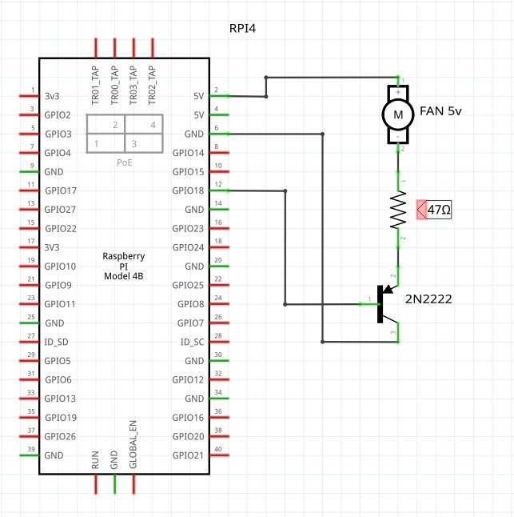

# Fan Control for raspberry Pi

Simple script to control Raspberry Pi Fan

### Scheme



Hardware:

1. Any Raspberry Pi
2. 5v Fan
3. Transistor 2N2222 https://datasheetspdf.com/pdf-file/1129135/SEMTECH/2N2222/1
4. Resistor 47Ω (Optional, to decrease the fan speed)

## Installation

1. Clone repository to some location
    ```shell
    cd ~/dev
    git clone https://github.com/paulwinex/rpi_fan_control.git
    ```
2. Edit file `fan_control.service` and replace `[REPLACE PATH]` to actual py-file location
    ```
    ExecStart=/usr/bin/python /home/pi/dev/rpi_fan_control/fan_control.py
    ```
3. Copy or link file `fan_control.service` to `/ets/systemd/system` folder using sudo
    ```shell
    sudo ln -s /home/pi/dev/rpi_fan_control/fan_control.service /etc/systemd/system/fan_control.service
    sudo chmod 644 /etc/systemd/system/fan_control.service
    ```
4. Enable new service

    ```shell
    sudo systemctl daemon-reload
    sudo systemctl enable fan_control.service
    ```

5. Reboot
    ```shell
    reboot
    ```

### Config

By default, the fan will be switched on when CPU the temperature exceeds 70 degrees,
and off when the temperature falls below 55. You can change it using config file.

1. Create file `/opt/fan_control.json`

2. Put this lines to file and edit values
    ```json
    {
        "temp_on": 80,
        "temp_off": 55
    }
    ```
 
3. Save file

You don't need to restart service. The new values will be read automatically.

### Environment variables

`FAN_CONTROL_LOG_DIR` - Path to fogs dir. Default: `/var/log`

`FAN_CONTROL_CONFIG_FILE` = Path to config file. Default: `/opt/fan_control.json`

### Test

You can test script using benchmark utility

```shell
sysbench --num-threads=4 --validate=on --test=cpu --cpu-max-prime=5000 run
```

To watch current temperature execute this command in different terminal

```shell
watch -n 1 -t vcgencmd measure_temp
```
